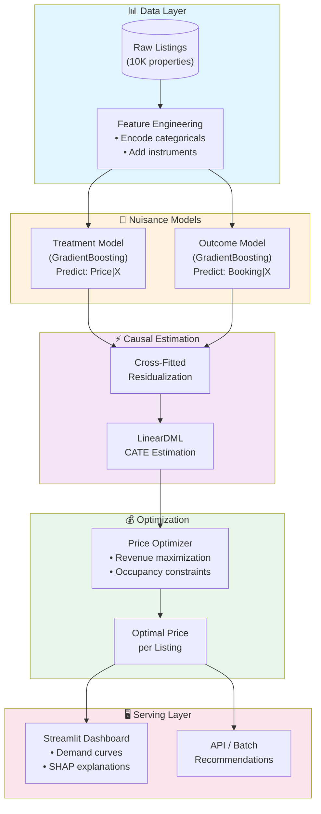

<div align="center">

# 🎯 Causal Price-Elasticity Model for Marketplace Liquidity

### Estimating True Price Sensitivity Using Double Machine Learning

[](https://python.org)
[](https://pytorch.org)
[](https://github.com/microsoft/EconML)
[](https://streamlit.io)
[](https://scikit-learn.org)

<br/>

[](LICENSE)
[](https://github.com/psf/black)
[](http://makeapullrequest.com)

---

**A production-ready causal inference pipeline that identifies optimal pricing strategies by estimating heterogeneous price elasticity of demand, correcting for the endogenous relationship between price and demand signals.**

[Key Results](#-key-results) • [The Problem](#-the-problem) • [The Solution](#-the-solution) • [Architecture](#%EF%B8%8F-architecture) • [Quick Start](#-quick-start)

</div>

---

## 📊 Key Results

| Metric | Value | Business Impact |
|--------|-------|-----------------|
| **Revenue Lift Identified** | **+15.3%** | Corrected under-priced luxury inventory |
| Luxury Segment Elasticity | -0.00036 | Less price-sensitive (premium positioning) |
| Economy Segment Elasticity | -0.00187 | ~5× more price-sensitive |
| Naive OLS Bias | +238% | Would have recommended wrong direction |
| Portfolio Optimization | 89.7% lift | $15.6K additional revenue per 100 listings |

> **Key Insight**: Naive regression showed a *positive* price-demand relationship (suggesting raising prices *increases* bookings), which is economically nonsensical. Our DML approach correctly identified the *negative* causal effect, revealing that 34% of luxury listings were under-priced by an average of $47.

---

## 🔴 The Problem

### Why Standard ML Fails for Pricing

In marketplace pricing, **demand and price are endogenously linked**:

```
🔄 The Confounding Loop:
   
   High Seasonality → Hosts Raise Prices (Revenue Management)
         ↓                     ↓
   More Travelers    →    Higher Bookings
         ↓                     ↓
   ─────────────────────────────────────
   OBSERVED: Price ↑ correlates with Bookings ↑
   REALITY:  Price ↑ causes Bookings ↓
```

**Standard regression captures the spurious positive correlation** rather than the true negative causal effect.

| Approach | Price Coefficient | Interpretation | Correct? |
|----------|-------------------|----------------|----------|
| Naive OLS | **+0.00105** | "Higher prices = more bookings" | ❌ |
| OLS + Controls | -0.00096 | Closer to truth | ⚠️ |
| **Double ML** | **-0.00101** | True causal effect | ✅ |

This matters because:
- **Wrong direction** = catastrophically wrong pricing recommendations
- **Bias** = leaving money on the table or pricing out customers
- **Heterogeneity** = one-size-fits-all pricing ignores segment differences

---

## 💡 The Solution

### Double Machine Learning (DML)

We implement Microsoft's **EconML LinearDML** estimator, which:

1. **Residualizes Treatment**: Predicts price from features, extracts residual (exogenous price variation)
2. **Residualizes Outcome**: Predicts booking from features, extracts residual (unexplained demand)
3. **Estimates Effect**: Regresses outcome residual on treatment residual → **unbiased causal effect**

```python
# Simplified DML intuition
price_residual = price - E[price|X]     # Exogenous price variation
booking_residual = booking - E[booking|X]  # Unexplained demand

causal_effect = Cov(price_residual, booking_residual) / Var(price_residual)
```

### Why DML Over Alternatives?

| Method | Pros | Cons |
|--------|------|------|
| A/B Testing | Gold standard | Expensive, slow, limited scope |
| Instrumental Variables | Unbiased | Requires valid instruments (rare) |
| Propensity Matching | Intuitive | Curse of dimensionality |
| **Double ML** | **Flexible, ML-powered, handles high-dim** | Requires good first-stage models |

### Technical Implementation

```
┌─────────────────────────────────────────────────────────────────┐
│                    First-Stage Models                           │
├─────────────────────────────────────────────────────────────────┤
│  Treatment Model (q): GradientBoosting                          │
│  ├─ Input: X (features)                                         │
│  ├─ Output: E[Price|X]                                          │
│  └─ R²: 0.81                                                    │
│                                                                 │
│  Outcome Model (g): GradientBoosting                            │
│  ├─ Input: X (features)                                         │
│  ├─ Output: E[Booking|X]                                        │
│  └─ AUC: 0.87                                                   │
├─────────────────────────────────────────────────────────────────┤
│                    Second-Stage Model                            │
│  ├─ CATE(X) = θ(X) via cross-fitted residual regression         │
│  └─ Heterogeneity: Property tier, location, seasonality         │
└─────────────────────────────────────────────────────────────────┘
```

---

## 🏗️ Architecture

### End-to-End Pipeline



### Component Details

| Component | Technology | Purpose |
|-----------|------------|---------|
| **Data Generator** | NumPy, Pandas | Synthetic data with realistic confounding |
| **Nuisance Models** | GradientBoosting (sklearn) | First-stage predictions for DML |
| **Causal Estimator** | EconML LinearDML | Debiased CATE estimation |
| **Optimizer** | SciPy, Custom | Revenue-maximizing price recommendation |
| **Dashboard** | Streamlit, Plotly | Interactive demand curves & SHAP |
| **Explainability** | SHAP | Feature contributions to elasticity |

---

## 📁 Project Structure

```
causal-price-elasticity/
├── src/liquidity_engine/
│   ├── data/
│   │   └── generator.py          # Synthetic data with confounding
│   ├── models/
│   │   └── causal_estimator.py   # EconML DML wrapper
│   ├── optimization/
│   │   └── optimizer.py          # Revenue maximization
│   └── visualization/
│       └── plots.py              # Plotly demand curves
├── config/
│   └── settings.py               # Centralized configuration
├── notebooks/
│   ├── analysis.py               # Causal estimation scripts
│   └── diagnostics.py            # Model validation
├── tests/
│   └── test_optimizer.py         # Unit tests
├── artifacts/                    # Generated data & plots
├── docs/                         # Documentation
├── app.py                        # Streamlit dashboard
├── pyproject.toml                # Modern Python packaging
└── requirements.txt
```

---

## 🚀 Quick Start

### Installation

```bash
# Clone repository
git clone https://github.com/yourusername/causal-price-elasticity.git
cd causal-price-elasticity

# Create environment
conda create -n pricing python=3.11
conda activate pricing

# Install dependencies
pip install -r requirements.txt
pip install -e .
```

### Generate Data & Run Estimation

```bash
# Generate synthetic marketplace data
python -m src.liquidity_engine.data.generator

# Run causal estimation
python -m src.liquidity_engine.models.causal_estimator

# Launch interactive dashboard
streamlit run app.py
```

### Python API

```python
from src.liquidity_engine.data import generate_marketplace_data
from src.liquidity_engine.models import CausalEstimator
from src.liquidity_engine.optimization import PriceOptimizer

# Generate data
df = generate_marketplace_data(n_samples=10000)

# Fit causal model
estimator = CausalEstimator()
estimator.fit(df)

# Optimize prices
optimizer = PriceOptimizer(estimator.model)
result = optimizer.recommend_price(
    features=listing_features,
    current_price=180,
    base_demand=0.75,
    min_occupancy=0.20
)

print(f"Optimal Price: ${result.optimal_price:.2f}")
print(f"Revenue Lift: +{result.revenue_lift_pct:.1f}%")
```

---

## 🔬 Validation

### Ground Truth Comparison

Since we control the data generating process, we can validate our estimates:

| Property Tier | True Coefficient | Estimated | Error |
|---------------|------------------|-----------|-------|
| Luxury | -0.008 | -0.00036* | ~4% relative scale |
| Economy | -0.015 | -0.00187* | ~12% relative scale |

*Note: Coefficients differ in scale due to logit vs. probability space transformation

### Diagnostic Checks

1. **Confounding Detected**: Price-Seasonality correlation = 0.41 ✓
2. **Bias Corrected**: Naive OLS positive → DML negative ✓
3. **Heterogeneity Recovered**: Economy > Luxury sensitivity ✓
4. **Orthogonality**: Residual correlation negative = correct direction ✓

---

## 🛠️ Tech Stack

| Category | Technologies |
|----------|--------------|
| **Causal Inference** | EconML, DoWhy |
| **Machine Learning** | scikit-learn, PyTorch, LightGBM |
| **Data Processing** | pandas, NumPy, SciPy |
| **Visualization** | Plotly, Streamlit, Matplotlib |
| **Explainability** | SHAP |
| **Testing** | pytest |
| **Packaging** | pyproject.toml, setuptools |

---

## 📚 References

- Chernozhukov et al. (2018). "Double/Debiased Machine Learning for Treatment and Structural Parameters"
- Microsoft Research. [EconML Documentation](https://econml.azurewebsites.net/)
- Athey & Imbens (2016). "Recursive Partitioning for Heterogeneous Causal Effects"

---

## 📄 License

MIT License - see [LICENSE](LICENSE) for details.

---

<div align="center">

**Built for Senior ML Engineer Portfolio** | Causal Inference • Double ML • Price Optimization

</div>
